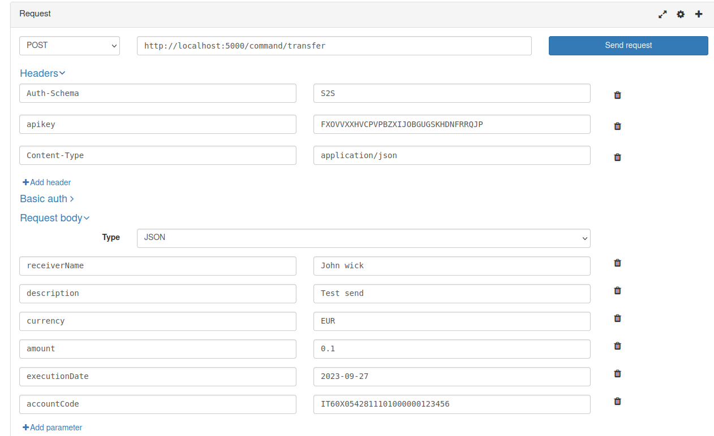
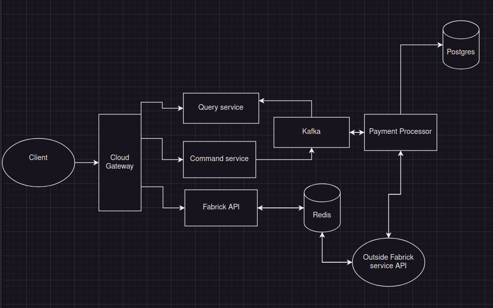

# FabrickApp
Fabrick take home assignment

## prerequisites
Docker and Docker-Compose\
Maven\
Bash\
Free port 5432, 9092, 5000

## Running the application
If you are on linux then you can run script **start.sh**.
Or you can mvn clean install root folder and then run docker compose on ./Deployment/docker-compose.yaml

## Documentation:
You can find the swagger by this link (after you run the applicaiton of course)
http://localhost:5000/swagger-ui.html

Example of creation of transfer with applicable values (Date should be today or later) 

## Architecture

This project follows hybrid CQRS pattern with command and query services.

Three services have open endpoints:
- /api -> serves as entrypoint to FabrickAPI from document. It provides values such as balance, account info and transactions
- /command -> serves as main endpoint for transfer request. It puts values into kafka topic.
- /query -> serves as a way to read data from kafka.

Payment processor is asyncronous services that sends and receives data from Fabrick API as it's main instrument for payments creation.
